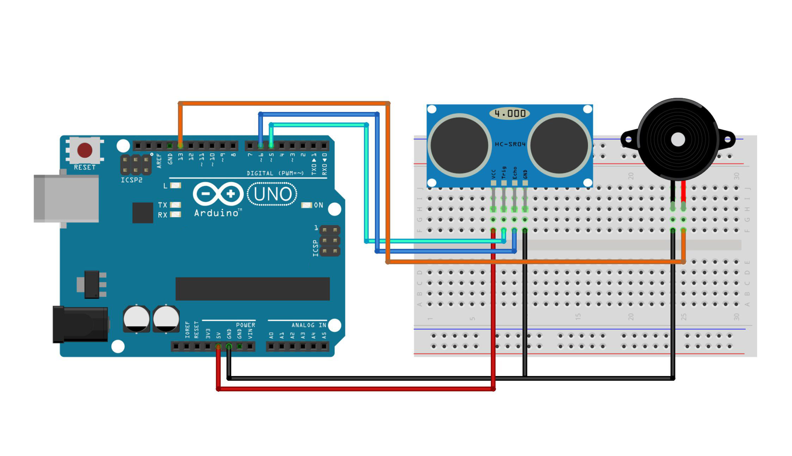

# Walking Aids for the Blind

This project demonstrates a walking aid for the blind using an Arduino. The system uses an ultrasonic sensor to measure the distance to obstacles and provides audio feedback through a buzzer. The buzzer sounds with varying intervals based on the distance to help users avoid obstacles.

## Components Used

- **Arduino IDE**
- **Library: HC-SR04**
- **Arduino Uno** (or compatible board) - 1 Unit
- **HCSR04 Ultrasonic Sensor** - 1 Unit
- **Buzzer** - 1 Unit
- **Project Board / BreadBoard** - 1 Unit
- **Jumper Wires**
- **Power Supply or Batterai** (for Arduino and other components)
- **Stick Mockup** - 1 Unit

## Schematic

Below you can see a schematic image to facilitate the wiring of cables from the microcontroller to devices, both input and output sensors:



## Circuit Diagram

### Wiring Instructions

- **HCSR04 Ultrasonic Sensor:**
  - **Trig Pin** to Digital Pin 5 (D5) on the Arduino
  - **Echo Pin** to Digital Pin 6 (D6) on the Arduino
  - **VCC** to 5V
  - **GND** to GND
- **Buzzer:**
  - **Positive Pin** to Digital Pin 13 (D13) on the Arduino
  - **Negative Pin** to GND

## How It Works

- The HCSR04 ultrasonic sensor measures the distance to obstacles in front of the user.
- The buzzer provides audio feedback, with the interval between sounds depending on the distance:
  - If the distance is greater than 100 cm, the buzzer sounds with a fixed interval.
  - If the distance is less than or equal to 100 cm, the interval between buzzer sounds decreases, helping the user detect closer obstacles.

## Code Explanation

- **Sensor Initialization:** The HCSR04 ultrasonic sensor is connected to pins D5 (Trig) and D6 (Echo).
- **Buzzer Control:** The buzzer is connected to pin D13 and sounds with varying intervals based on the distance measured by the ultrasonic sensor.

```cpp
#include <HCSR04.h>     // Library for HCSR-04
HCSR04 hc(5, 6);       // Initialize HCSR04 (Trig pin, Echo pin)

#define buzzer 13

void setup() {
  pinMode(buzzer, OUTPUT);
}

void loop() {
  int jarak = hc.dist();      // Read distance
  if (jarak > 100) {         // If distance > 100 cm
    jarak = 100;
  } else if (jara

```

## Installation

1. Gather all components listed above.
2. Connect the components following the wiring instructions.
3. Open the Arduino IDE and connect your Arduino board.
4. Copy the provided code into the Arduino IDE.
5. Upload the code to your Arduino Uno.

## Usage

- The system continuously measures the distance to obstacles and provides feedback through the buzzer.
- The buzzer's sound interval will adjust based on the proximity of obstacles, helping users navigate their environment.

## Conclusion

- The Walking Aids for the Blind project offers an effective solution for obstacle detection and navigation assistance. The system's audio feedback helps users avoid obstacles and enhances their mobility.
- The delay off the buzzer depends on the distance to the sensor object. The closer it is, the greater the off delay A little.
